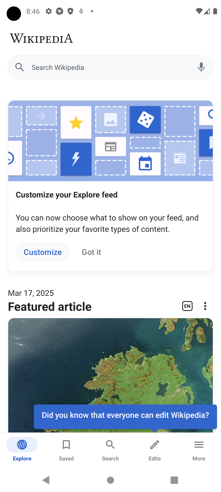

# Проект по автоматизации тестирования для мобильного приложения "Wikipedia"

<p align="center">
  
</p>

## :pencil: Содержание:

- [Используемый стэк](#hammer_and_wrench-используемый-стэк)
- [Реализованные Mobile проверки](#white_check_mark-реализованные-mobile-проверки)
- [Запуск тестов](#arrow_forward-запуск-тестов)
    - [Локально](#локально)
- [Отчеты о прохождении тестов](#bar_chart-отчеты-о-прохождении-тестов)
    - [Allure](#allure)

### :hammer_and_wrench: Используемый стэк


### :white_check_mark: Реализованные Mobile проверки

- [x] Отображение результатов поиска
- [x] Открытие страницы из результатов поиска
- [x] Проверка первых четырех экранов Getting Started

## :arrow_forward: Запуск тестов

### Локально
> [!NOTE]
> Ключ `--context` не обязателен, по умолчанию тесты будут запущены на BrowserStack
* Для запуска на реальном устройстве указать ключ `--context=local_real_device`
* Для запуска на виртуальном устройстве указать ключ `--context=local_real_device`
* Для запуска на BrowserStack указать ключ `--context=bstack`

```bash
poetry install
pytest --context=bstack
```

## :bar_chart: Отчеты о прохождении тестов

### Allure

Для просмотра отчета локально нужно ввести команду:

```bash
allure serve
```

Примеры отображения тестов:


